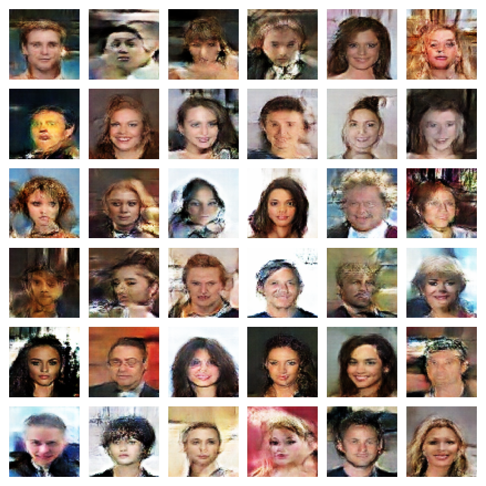
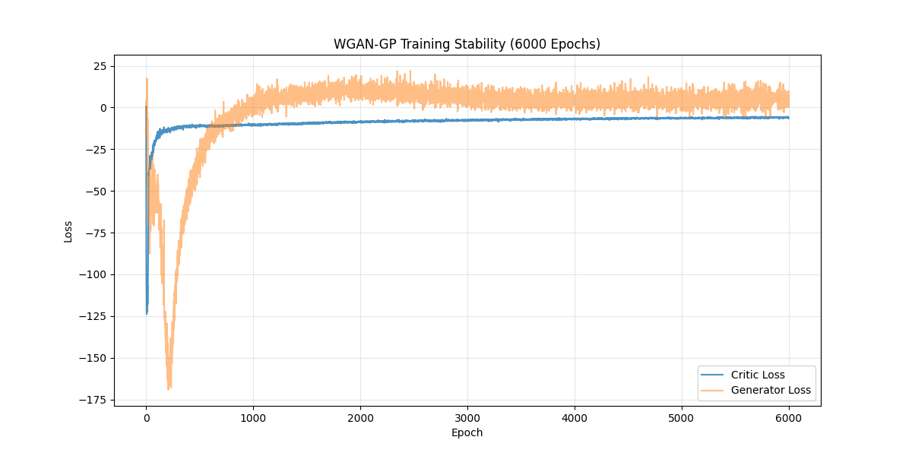

# Training Analysis Report: `unknown`

**Generated:** `2026-01-13 07:27`  
**Epochs Completed:** `6000` (configured: 6000)  
**Final D Loss:** `-6.0503`  
**Final G Loss:** `4.7688`  

---

## 1. Visualizations

### Generated Faces

### Training Loss

---

## 2. Training Verdict

| Metric | Value |
|--------|-------|
| **Stability** | **✅ STABLE** |
| **D/G Ratio** | `1.2687` (>0.01 is good) |
| **Loss Variance** | `0.059553` (Lower is better) |
| **Final W-Dist** | `4.6844` (Higher is better initially) |

---

## 3. Configuration
| Parameter | Value |
|-----------|-------|
| Batch Size | 512 |
| Critic LR | 0.0002 |
| Generator LR | 0.0002 |
| Gradient Penalty | 10 |
| n_critic | 5 |

---

## 4. Training Progression (Phase-wise Metrics)

| Phase | Epoch Range | D Loss (Start -> End) | G Loss (Start -> End) | Δ D/epoch | Δ G/epoch |
|-------|-------------|-----------------------|-----------------------|-----------|-----------|
| Warmup | 0-120 | -76.72 -> -16.31 | -7.81 -> -61.96 | 0.5034 | -0.4513 |
| Early | 120-900 | -15.93 -> -10.72 | -66.70 -> -0.24 | 0.0067 | 0.0852 |
| Mid | 900-3000 | -10.47 -> -7.93 | -3.44 -> 6.72 | 0.0012 | 0.0048 |
| Late | 3000-5100 | -7.62 -> -6.11 | 4.94 -> 4.79 | 0.0007 | -0.0001 |
| Final | 5100-6000 | -6.09 -> -6.17 | 5.27 -> 3.80 | -0.0001 | -0.0016 |

---

## 5. Stability Indicators

| Indicator | Status | Observation |
|-----------|--------|-------------|
| **Monotonicity** | ✅ | Variance: 0.059553 |
| **Balance** | ✅ | D/G Ratio: 1.2687 |
| **Mode Collapse** | ✅ | G Loss magnitude: 4.77 |

---

## 6. Notes
- **W-Distance**: Should grow initially and then stabilize. Current final: 4.6844
- **Critic**: Should maintain ability to distinguish (D loss > 0).
