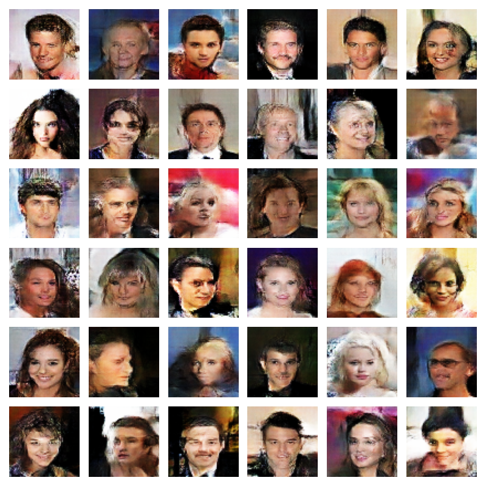
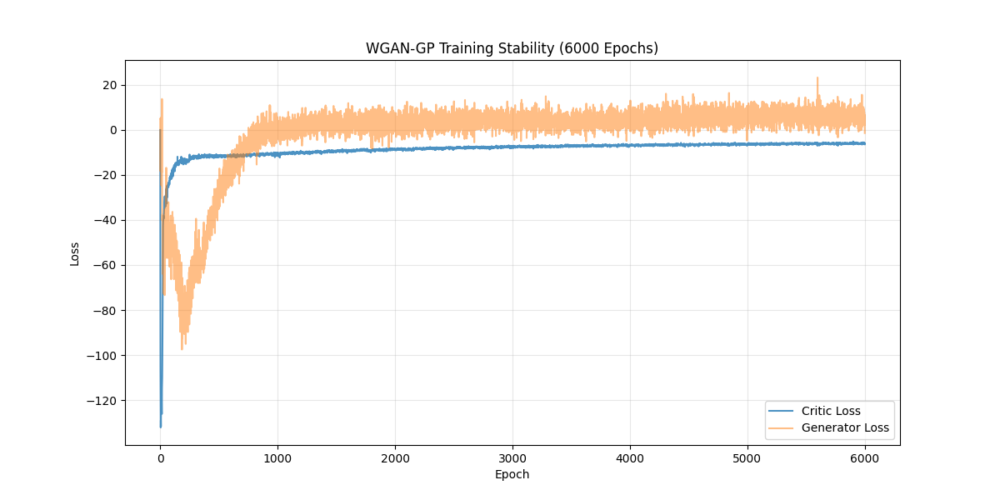

# Training Analysis Report: `0003`

**Generated:** `2026-01-11 03:51`  
**Total Epochs:** `6000`  
**Final D Loss:** `-6.0056`  
**Final G Loss:** `5.4670`  

---

## 1. Visualizations

### Generated Faces

### Training Loss

---

## 2. Training Verdict

| Metric | Value |
|--------|-------|
| **Stability** | **✅ STABLE** |
| **D/G Ratio** | `1.0985` (>0.01 is good) |
| **Loss Variance** | `0.056198` (Lower is better) |
| **Final W-Dist** | `5.3404` (Higher is better initially) |

---

## 3. Configuration
| Parameter | Value |
|-----------|-------|
| Batch Size | 512 |
| Critic LR | 0.0002 |
| Generator LR | 0.0002 |
| Gradient Penalty | 10 |
| n_critic | 5 |

---

## 4. Training Progression (Phase-wise Metrics)

| Phase | Epoch Range | D Loss (Start -> End) | G Loss (Start -> End) | Δ D/epoch | Δ G/epoch |
|-------|-------------|-----------------------|-----------------------|-----------|-----------|
| Warmup | 0-100 | -84.06 -> -19.86 | -4.88 -> -50.47 | 0.6420 | -0.4559 |
| Early | 100-1000 | -19.10 -> -10.93 | -47.26 -> 0.04 | 0.0091 | 0.0525 |
| Mid | 1000-4000 | -10.64 -> -7.03 | 0.22 -> 4.96 | 0.0012 | 0.0016 |
| Late | 4000-6000 | -6.85 -> -6.07 | 4.37 -> 4.36 | 0.0004 | -0.0000 |

---

## 5. Stability Indicators

| Indicator | Status | Observation |
|-----------|--------|-------------|
| **Monotonicity** | ✅ | Variance: 0.056198 |
| **Balance** | ✅ | D/G Ratio: 1.0985 |
| **Mode Collapse** | ✅ | G Loss magnitude: 5.47 |

---

## 6. Notes
- **W-Distance**: Should grow initially and then stabilize. Current final: 5.3404
- **Critic**: Should maintain ability to distinguish (D loss > 0).
