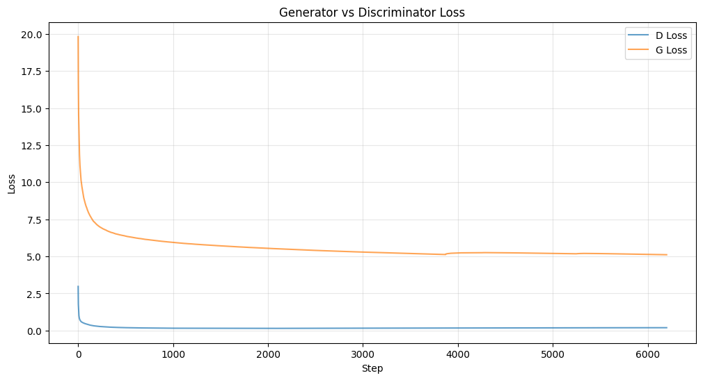
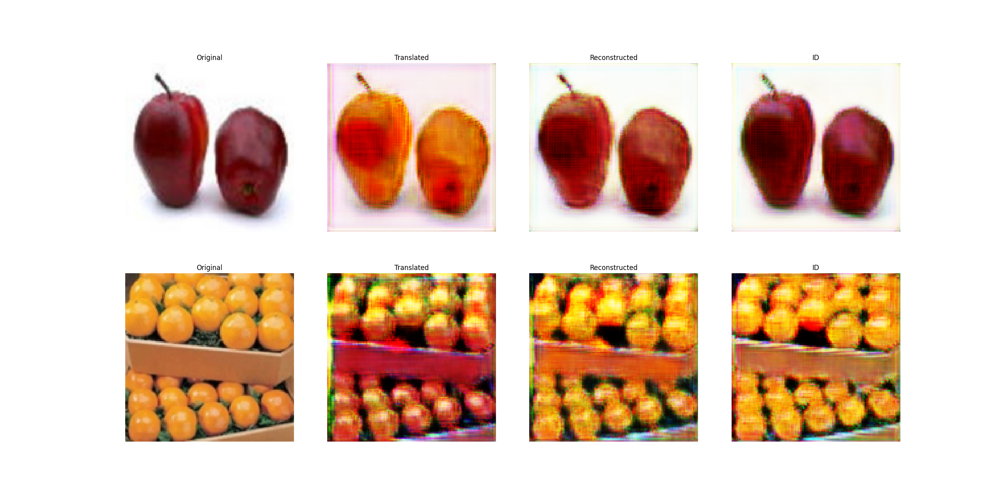
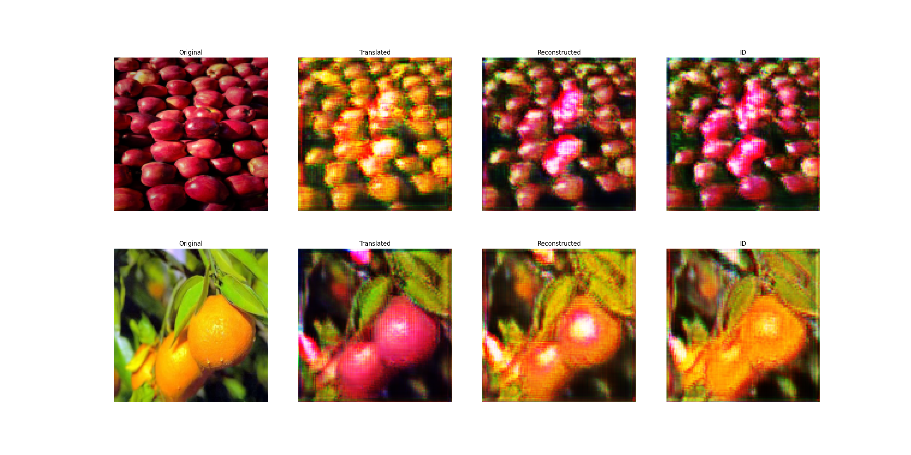
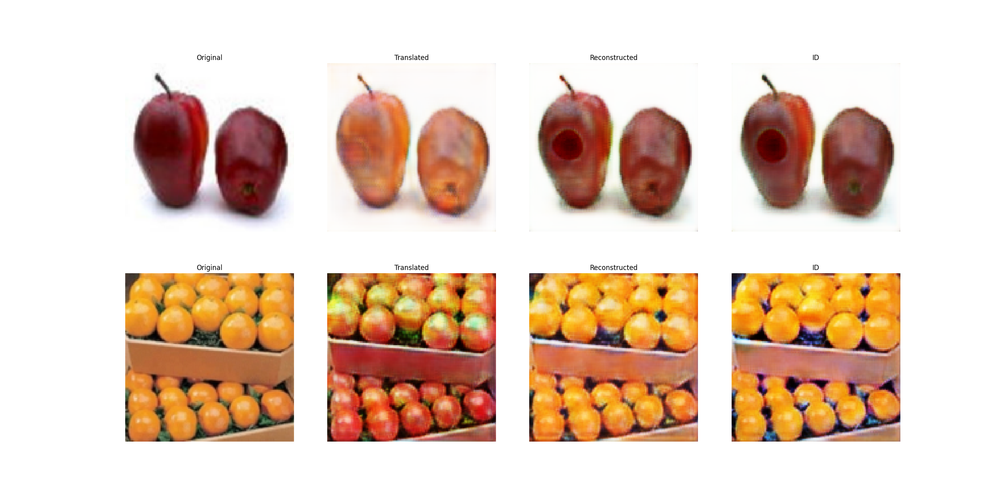
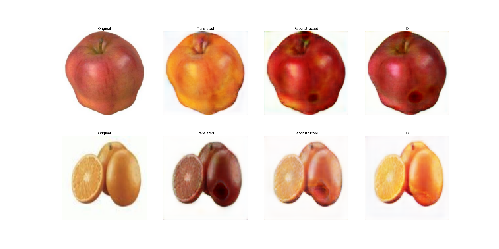
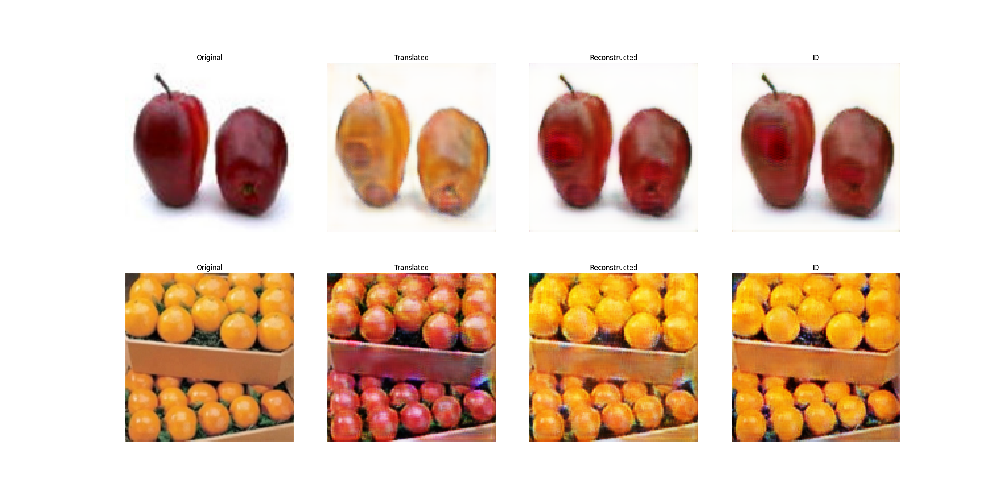
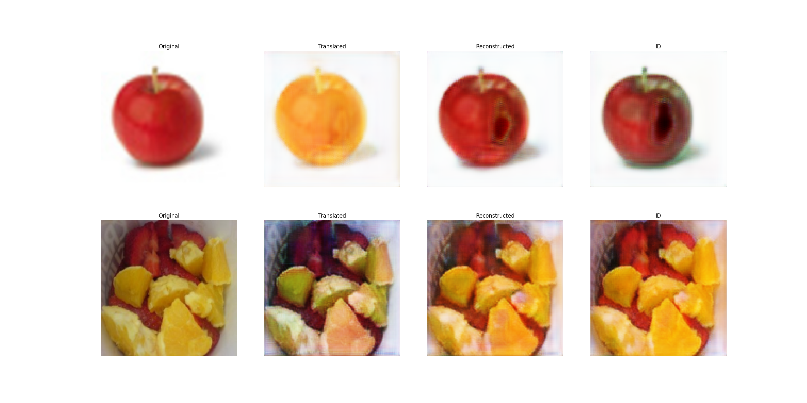

# CycleGAN Training Analysis: Run 010

**Generated**: 2026-01-21 00:15
**Dataset**: apple2orange
**Total Epochs**: 100
**Final D Loss**: 0.1908
**Final G Loss**: 5.1135

---

## Training Verdict

| Metric | Value |
|--------|-------|
| **Stability** | ✅ STABLE |
| **Quality** | Good |
| **Recommendation** | Continue training |

---

## Configuration

| Parameter | Value |
|-----------|-------|
| Batch Size | 16 |
| Epochs | 100 |
| Learning Rate | 0.0002 |
| Generator Filters | 64 |
| Discriminator Filters | 64 |
| Buffer Size | 50 |
| Lambda Cycle | 10 |
| Lambda ID | 2 |

---

## Training Progression (Phase-wise Metrics)

| Phase | Epoch Range | D Loss (Start -> End) | G Loss (Start -> End) | Δ D/step | Δ G/step |
|-------|-------------|-----------------------|-----------------------|----------|----------|
| Warmup | 0-10 | 2.97 -> 0.18 | 19.83 -> 6.23 | -0.0045 | -0.0219 |
| Early | 10-30 | 0.18 -> 0.14 | 6.23 -> 5.59 | -0.0000 | -0.0005 |
| Mid | 30-70 | 0.14 -> 0.18 | 5.59 -> 5.25 | 0.0000 | -0.0001 |
| Late | 70-100 | 0.18 -> 0.19 | 5.25 -> 5.11 | 0.0000 | -0.0001 |

---

## Stability Indicators

| Indicator | Status | Observation |
|-----------|--------|-------------|
| Variance Reduction | ✅ Good | Variance: 0.0131 -> 0.0001 |
| D Loss Range | ✅ Good | Final D Loss: 0.1908 (Target ~0.25) |
| Reconstruction | ✅ Good | Cycle Loss component: 1.58 / Total G: 5.11 |

---

## Loss Visualization

---

## Generated Samples

### Epoch 1 (A -> B)

### Epoch 1 (B -> A)

### Epoch 50 (A -> B)

### Epoch 50 (B -> A)

### Epoch 99 (A -> B)

### Epoch 99 (B -> A)

## Notes
- Run 010 completed 100 epochs.
- Generator and Discriminator losses remained balanced.
